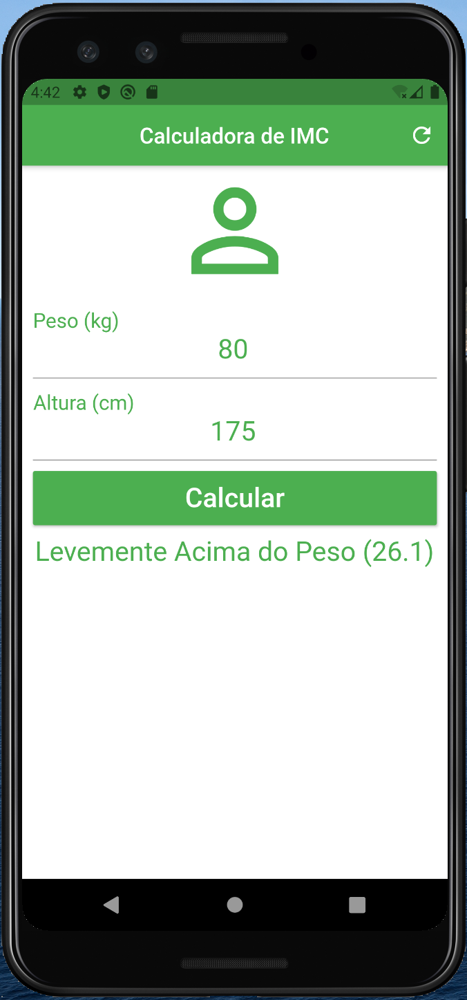

# Calculadora de IMC

Aplicativo para fazer o calculo do Índice de Massa Corporal (IMC) e notificar a situação atual do seu corpo. 

## Getting Started

Para obter ajuda sobre como iniciar o Flutter, consulte nossa [documentação](https://flutter.io/) on-line .

## Screenshots

| Tela 1 | Tela 2 | Tela 3 |
| --------|--------|--------|
||||
